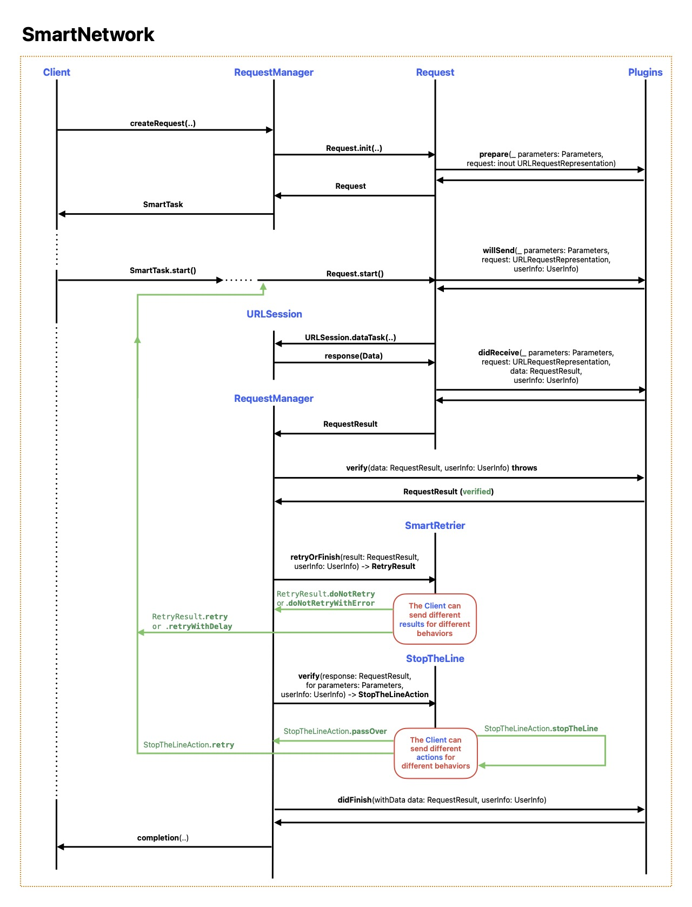
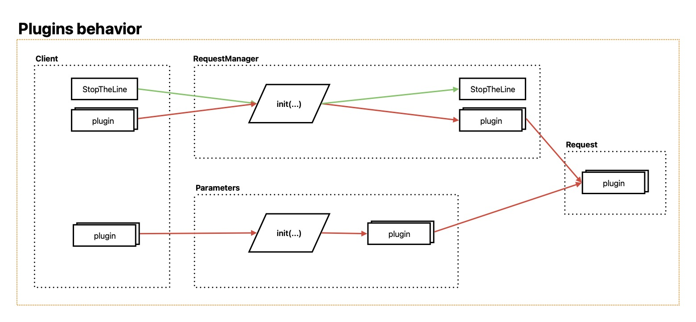

# SmartNetwork

[](https://swiftpackageindex.com/NikSativa/SmartNetwork)
[](https://swiftpackageindex.com/NikSativa/SmartNetwork)
[](https://github.com/NikSativa/SmartNetwork/actions/workflows/swift_macos.yml)
[](https://opensource.org/licenses/MIT)

**SmartNetwork** is a lightweight, developer-friendly networking library for Swift. It wraps `URLSession` in a clean and flexible API that’s fully compatible with Swift Concurrency. Whether you’re into `async/await` or prefer trusty closures, SmartNetwork helps you build robust, testable network layers—without all the boilerplate.

---

## ✨ Features

- Clean, strongly typed networking using `Decodable`.
- Supports both `async/await` and closure-based APIs.
- Built-in decoding for common response types:
  - `Void` — when you don’t expect data back.
  - `Data` — raw binary responses.
  - `Decodable` — your custom models.
  - `UIImage` (or `NSImage`) — image fetching made easy.
  - `Any` — raw JSON as dictionaries or arrays.
- Custom decoding support with the `Deserializable` protocol.
- Decode deeply nested JSON with `keyPath`.
- Plugin system for logging, auth, request mutation, and more.
- Control request lifecycles via `SmartTask`.
- Built-in stubbing support for reliable, isolated tests.

---

## 🚀 Usage

SmartNetwork offers multiple styles for making requests, allowing you to choose what best fits your coding style or project needs.

### 🔹 Async/await

Perform a request using Swift's modern concurrency syntax:

```swift
let result = await manager.decodable.request(TestInfo.self, address: address)
```

### 🔹 Closure-based

Use completion handlers for backward compatibility or callback-driven workflows:

```swift
manager.decodable.request(TestInfo.self, address: address) { result in
    // Handle result here
}.start()
```

### 🔹 Fluent chainable API

Construct readable, chainable network calls using SmartNetwork’s fluent API:

```swift
let result = await manager.request(address: address).decodeAsync(TestInfo.self)
```

```swift
manager.request(address: address)
    .decode(TestInfo.self)
    .complete { result in
        // Handle result here
    }
    .detach()
    .deferredStart()
```

These patterns offer flexibility whether you're building simple calls or need more granular control over the request lifecycle.

---

## 🧩 Plugin system

SmartNetwork includes a modular plugin system that allows you to customize and extend networking behavior without changing core logic. Plugins can be used to modify requests, inspect responses, or enforce specific policies.

Here are some built-in plugins you can use:

- `Plugins.StatusCode` – Validates HTTP status codes and can trigger custom error handling.
- `Plugins.Basic`, `Plugins.Bearer` – Easily apply Basic or Bearer authentication headers.
- `Plugins.TokenPlugin` – Inject custom tokens via headers or query parameters.
- `Plugins.Log`, `Plugins.LogOS` – Output curl-style debug logs or use system logging.
- `Plugins.JSONHeaders` – Automatically adds `Content-Type` and `Accept` headers for JSON APIs.
- `PluginPriority` – Define the order in which plugins execute.
- `StopTheLine` – Temporarily blocks all requests (e.g. during token refresh or maintenance).

You can combine and prioritize plugins to precisely control the behavior of your networking pipeline.

---

## 🔧 Custom decoding

You can define types that include a decoding key path for nested JSON parsing:

```swift
protocol KeyPathDecodable {
    associatedtype Response: Decodable
    static var keyPath: [String] { get }
}

extension SmartRequestManager {
    func keyPathed<T: KeyPathDecodable>(_ type: T.Type = T.self) -> TypedRequestManager<T.Response?> {
        return custom(KeyPathDecodableContent<T>())
    }
}
```

---

## 🧪 Testing

SmartNetwork makes it easy to write fast, isolated unit tests with support for stubbing and mocking via `HTTPStubServer` and [`SpryKit`](https://github.com/NikSativa/SpryKit).

---

## 🖼️ Image loading

Need to fetch and display images? Pair SmartNetwork with [`SmartImages`](https://github.com/NikSativa/SmartImages) for async image loading support.

---

## 📚 Documentation

- [SmartNetwork Overview (PDF)](./.instructions/SmartNetwork.pdf)  
  

- [Plugins Behavior (PDF)](./.instructions/Plugins_behavior.pdf)  
  

---

## 📦 Installation

To add SmartNetwork to your project via Swift Package Manager:

```swift
.package(url: "https://github.com/NikSativa/SmartNetwork.git", from: "5.0.0")
```

Then, add `"SmartNetwork"` to your target dependencies.

---

## 📄 License

`SmartNetwork` is available under the MIT License.
