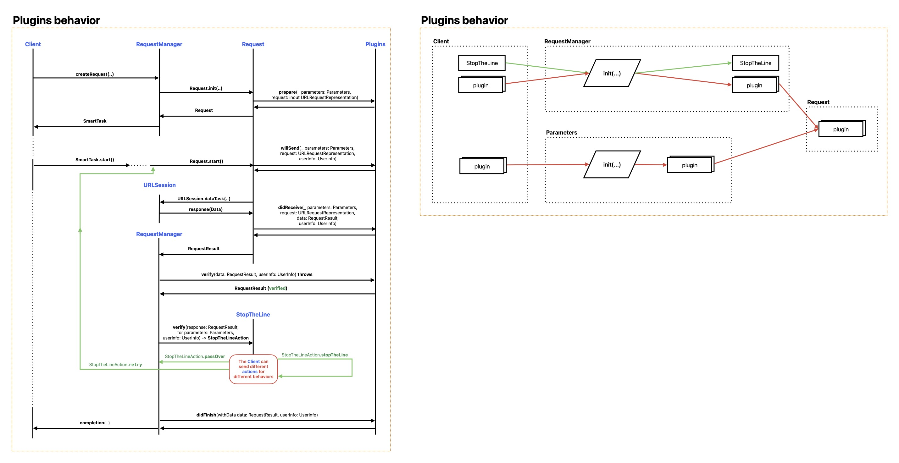

# SmartNetwork
[](https://swiftpackageindex.com/NikSativa/SmartNetwork)
[](https://swiftpackageindex.com/NikSativa/SmartNetwork)
[](https://github.com/NikSativa/SmartNetwork/actions/workflows/swift_macos.yml)
[](https://opensource.org/licenses/MIT)

Light weight wrapper around URLSession for easy network requests with strong typed responses based on Decodable protocol or your own custom decoding strategy.  

## The main features are: 
- strong typed responses based on Decodable protocol
  - async/await
  ```swift
  let result = await manager.decodable.request(TestInfo.self, address: address)
  ```
  
  - closure strategies
  ```swift
  manager.decodable.request(TestInfo.self, address: address) { result in ... }.start()
  ```

- predefined API for basic types: *Void, Data, any Decodable, Image, Any(JSON)*
- *async/await* and *closure* strategies in one interface
- use `Deserializable` to define your own decoding strategy or type
- decode with `keyPath` for nested json objects in response.
- **Plugin** is like Android interceptors. Handle every *request-response* in runtime! Make your own magic with validation, logging, auth, etc...
  + *Plugins.StatusCode* to handle http status codes or use *StatusCode* directly for easy mapping to human readable enumeration
  + *Plugins.Basic* or *Plugins.Bearer* for easy use auth strategy
  + *Plugins.TokenPlugin* to update every request headers or query parameters
  + *Plugins.Curl* to print every request in curl format
  + *Plugins.CurlOS* to print every request in curl format with OS Logger
  + *Plugins.JSONHeaders* to add json specific headers to every request
- **PluginPriority** to define order of plugins in chain of execution 
- **StopTheLine** mechanic to handle any case when you need to stop whole network and wait while you make something: *update auth token, handle Captcha etc..*
- **HTTPStubServer** mocks your own network in runtime. Make your magic while your server are not ready!
- **SmartTask** for managing the lifecycle of network requests. Cancel the task deinitiation request or handle the detached task manually - everything is under control!
- Easily complements [SmartImage](https://github.com/NikSativa/SmartImages) for image loading.

## See [how SmartNetwork works](./SmartNetwork.pdf)(in `pdf` format).


### New structure of network request organization based on that modern interface:

```swift
public protocol RequestManager {
    /// ``Void`` request manager.
    var void: TypedRequestManager<Void> { get }

    /// ``Decodable`` request manager.
    var decodable: DecodableRequestManager { get }

    // MARK: - strong

    /// ``Data`` request manager.
    var data: TypedRequestManager<Data> { get }

    /// ``Image`` request manager.
    var image: TypedRequestManager<Image> { get }

    /// ``JSON`` request manager.
    var json: TypedRequestManager<Any> { get }

    // MARK: - optional

    /// ``Data`` request manager.
    var dataOptional: TypedRequestManager<Data?> { get }

    /// ``Image`` request manager.
    var imageOptional: TypedRequestManager<Image?> { get }

    /// ``JSON`` request manager.
    var jsonOptional: TypedRequestManager<Any?> { get }

    // MARK: - custom

    /// Custom request manager which can be used to create a request manager with a custom ``Deserializable`` of your own choice.
    func custom<T: Deserializable>(_ decoder: T) -> TypedRequestManager<T.Object> 

    /// Custom request manager which can be used to create a request manager with a custom ``Deserializable`` of your own choice.
    func customOptional<T: Deserializable>(_ type: T) -> TypedRequestManager<T.Object?>
}
```

### New usage of API with short autocompletion:

```swift
Task {
    let address: Address = "www.apple.com"
    let manager = SmartRequestManager.create()
    let result = await manager.decodable.request(TestInfo.self, address: address)
    switch result {
    case .success(let obj):
        // do something with response
    case .failure(let error):
        // do something with error
    }
}
```
or
```swift
Task {
    let address: Address = "www.apple.com"
    let manager = SmartRequestManager.create()
    manager.decodable.request(TestInfo.self, address: address) { result in
        switch result {
        case .success(let obj):
            // do something with response
        case .failure(let error):
            // do something with error
        }
    }
    .detach().deferredStart()
}
```
or
```swift
Task {
    let address: Address = "www.apple.com"
    let manager = SmartRequestManager.create()
    let result = await manager.request(address: address).decodeAsync(TestInfo.self)
    switch result {
    case .success(let obj):
        // do something with response
    case .failure(let error):
        // do something with error
    }
}
```
or
```swift
let address: Address = "www.apple.com"
let manager = SmartRequestManager.create()
manager.request(address: address).decode(TestInfo.self).complete { result in
    switch result {
    case .success(let obj):
        // do something with response
    case .failure(let error):
        // do something with error
    }
}
.detach().deferredStart()
```

## Custom request manager

Customize your own network with your own custom decodable type:

```swift
/// Custom decodable protocol for decoding data from response with specified keyPath
protocol KeyPathDecodable<Response> {
    associatedtype Response: Decodable
    static var keyPath: [String] { get }
}

extension SmartRequestManager {
    func keyPathed<T: KeyPathDecodable>(_ type: T.Type = T.self) -> TypedRequestManager<T.Response?> {
        return custom(KeyPathDecodableContent<T>())
    }
}

private struct KeyPathDecodableContent<T: KeyPathDecodable>: Deserializable {
    func decode(with data: RequestResult, parameters: Parameters) -> Result<T.Response?, Error> {
        if let error = data.error {
            return .failure(error)
        } else if let data = data.body {
            if data.isEmpty {
                return .failure(RequestDecodingError.emptyResponse)
            }

            do {
                let obj = try data.decode(T.Response.self, keyPath: T.keyPath)
                return .success(obj)
            } catch {
                return .failure(error)
            }
        } else {
            return .success(nil)
        }
    }
}
```
